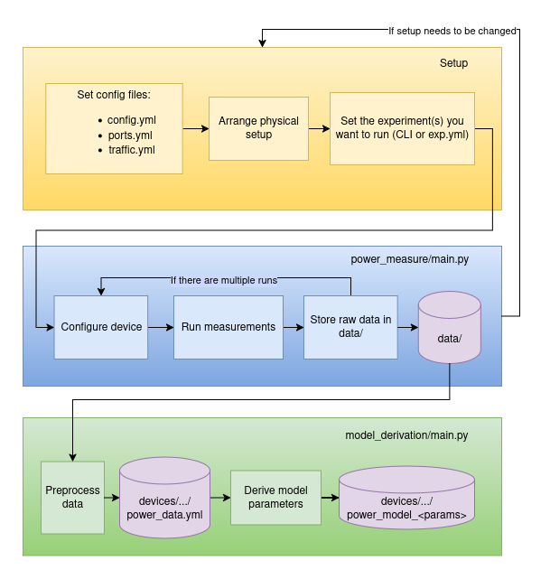

# NetPowerBench

> The P4 code and the configuration files described in [Jackie Lim's thesis, Power Modelling Framework for Network Switches](https://doi.org/10.3929/ethz-b-000663342) [[2]](#references) are available in the [`/archive`](/archive/configs_PowerModellingFrameworkforNetworkSwitches) directory.

NetPowerBench is a tool for generating a power model of a routing device. It is intended to be used in a lab setup.

The reason for the creation of the tool as well as a detailed description of the power model it generates is described in [[1]](#references). It is stronly encouraged to read this paper in order to be able to use this tool.

The workflow is separated into:
- Setting up and cnfiguring the device and running the measurements, mainly described in [`power_measure`](power_measure/README.md)
- Processing the data and deriving the model, described in [`model_derivation`](model_derivation/README.md)

This schema should give an impression of the general workflow. 



## Environment and Prerequisites

### Hardware

The tool needs the following componends:
- A Device Under Testing (DUT): A L2 or L3 routing device with at least 4 ports, ideally more
- A powermeter. It needs to support the pinpoint submodule. The one we used is linked [here](https://www.microchip.com/en-us/development-tool/ADM00706)
- A workstation that is running the experiment. It needs have two ports to send and receive traffic from the DUT, and it needs to be able to generate the traffic volume that the user wants to test. Furthermore it needs a Serial connection to the DUT and a connection to the powermeter. 

### Software

In order to run the experiments, we used the following software environment:
- Python: 3.10.12
- IDE: Visual Studio Code 
- OS: Ubuntu 22.04

There is a [requirements.txt](requirements.txt) available. 

## Repository structure

``` 

.
├── archive
│   └── ...
├── command
│   ├── pinpoint_sleep.sh
│   └── ...
├── devices
│   ├── example
│   │   ├── config.yml
│   │   ├── ports.yml
│   │   ├── power_data.yml
│   │   └── power_model_QSFP28_100G_LR_RDMA.yml
│   └── ...
├── legacy
│   └── ...
├── model_derivation
│   ├── args.yml
│   ├── main.py
│   └── ...
├── pinpoint
├── power_measure
│   ├── exp.yml
│   ├── main.py
│   └── ...
├── README.md
├── requirements.txt
├── test_config
│   ├── test_config.py
│   ├── test.yml
│   └── ...
└── traffic_gen
    ├── traffic_gen.py
    ├── traffic.yml
    └── ...
```

## Directories

### archive

The P4 code and the configuration of the Cisco devices used in [[2]](#references) are available in `\archive\configs_PowerModellingFrameworkforNetworkSwitches`.

### command

This directory contains the script that will execute pinpoint, the software used to conduct the measurements with the powermeter. Pinpoint is a submodule of this repository. 

### data

This directory will contain the raw data and metadata from the measurements. 

`log/` contains `pinpoint.log`, which is the log of the last measurements and is there for debugging reasons. 

For each device tested there will be a subdirectory with the device identifier as name. In there there will be directories with names following one of these formats:
- `base` 
- `idle`
- `port_<port_type>_<transceiver_type>_<port_speed>_<number_of_active_ports>p`
- `trx_<port_type>_<transceiver_type>_<port_speed>_<number_of_active_ports>p`
- `snake-test_<port_type>_<transceiver_type>_<port_speed>_<packet_size>_<bandwidth>`

Note that each of these directories refers to a test type and the corresponding test configuration. Relevant parameters can be port type, transceiver type, port speed, number of active ports, packet size or bandwidth, this depends on the test type. This means for example that as base and idle are indepentend of the port port speed, they don't contain an of that information in the directory name. 

Each test configuration directory contains one subdirectory per measurement run, named with the timestamp of when the measurement was taken. This directory contains:
-  `metadata.yml`: The metadata of the measurement
-  `power.log`: The acutal measurement data

A possible layout of `data` could look like this:
```
├── data
│   ├── log
│   │   └── pinpoint.log
│   └── ciscoNexus9336-FX2
│           └── snake-test_QSFP28_LR_100G_256B_2.5Gbps
│               ├── 2025-05-15_16:20:45
│               │   ├── metadata.yml
│               │   └── power.log
```

For further details on the test types and measurement procedure, please refer to the documentation in [`power_measure/`](power_measure/README.md).

### devices

For each DUT there needs to be a subdirectory in `devices/` with the device identifier as directory. That folder needs to contain the configuration files of that device. There are templates in that directory. 

When running the model derivation, it will first preprocess the raw data from `data/` and store it in here. Then it will use that data to derive the parameter values and store these in here too. 

### legacy

This directory contains an older version of this code and is here for reference. It is not expected to be usable. 

### model_derivation

This directory contains the code to process the raw measurement data and derive the power model values. 

### power_measure

This directory contains the code to run the measurements needed for the model derivation. 

### test_config

This directory contains code intended to help with finding the right configuration commands for the tests.

### traffic_gen

This directory contains all the files necessary for the traffic generation including the code, the configuration file and a setup script.

## Usage specification

In order to get a power model for a device, the following steps are advised:
1. Clone the submodule `pinpoint` with `git submodule init` and `git submodule update`
2. Compile the pinpoint binary (location needed in `config.yml`)
3. Follow the intructions in [`power_measure/`](power_measure/README.md#usage-specification) in order to set up and run the measurements on the device. 
3. Follow the instructions in [`model_derivation/`](model_derivation/README.md#usage-specification) in order to derive a power model 

### Example usage

Here is a list of the single steps that can be taken in order to create a power model for a CiscoNexus9336-FX2. The device ID used is `example`. The respective files can be found in [`devices/example`] or contain `example` in their file name (e.g. `traffic_example.yml`). 

1. Fill out `config.yml` as shown in the [example](devices/example/config.yml)
2. Fill out `ports.yml` as shown in the [example](devices/example/ports.yml)
3. Fill out `traffic.yml` as shown in the [example](traffic_gen/traffic.yml)
4. `cd power_measure/`

Base: 

5. Make sure that device is powered up and power meter is connected, but no transceivers are plugged into any ports.
6. Run a base test via CLI with 
   
   ```python main.py -d example -e base -s 100G -p QSFP28 -t PCC -r 1 ```

Idle, Port and Trx:

7.  Plugg transceivers into all ports, connecting port 1 with port 2, 3 with 4, 5 with 6, ... , 35 with 36. 
8.  Make sure the order in `ports.yml` under `ids` goes 1 2 3 4 ... 35 36
9.  Set `exp.yml` like in the [example](power_measure/exp_example.yml)
10. Run a idle, port and trx test by executing 
    
    ```python main.py```

Snake-test: 

11. Set device up for snake test. The only thing that needs to be changed from the previous setup is connecting port 35 and 36 with the workstation instead of each other
12. As port 35 and 36 are connected to the workstation make sure order in `ports.yml` is now 36 1 2 ... 35
13. `cd ../test_config/`
14. Set `test.yml` like in the [example](test_config/test_example.yml), so that system and snake-test are listed under `test` and reset is disabled. 
15. Preconfigure the device with 
    
    ```python test_config.py```

16. `cd ../power_measure`
17. Run snake-test with with CLI: 
    
    ```python main.py -d example -e snake-test -s 100G -p QSFP28 -t PCC -r 1 --disable_reset --not_reconfigure```
    
Model derivation
    
18. `cd ../model_derivation/`
19. Derive the power model with: 
    
    ```python main.py -d example -s 100G -p QSFP28 -t PCC -g RDMA ```

Note that for most steps, there are alternative ways to do them. Also, to improve the quality of the power model, multiple repeats are advised as well as mixing the order of the tests.

## Known issues

-  Sometimes the pinpoint software recognizes counters that are not from the powermeter and will also be present when it is unplugged. Our way of solving this is making the counters used a parameter in `config.yml`. In case of the pinpoint script getting stuck, we advise the user to verify that the counters used are the ones the powermeter writes to and adapt `config.yml` accordingly. 
- The traffic generation needs sudo rights in order to be executed properly. As this is not really resolvable for us, our workaround was to disable the necessity of a password for executing sudo commands.
- Currently for many scrips there are dependencies on from where they are executed. This might be changed in the future but for now, in order to have everything properly executed, please run a script only from the directory it is in.  

In case of any problems occuring, please open an issue. 

## References

1. Jacob, R., Röllin, L., Lim, J., Chung, J., Béhanzin, M., Wang, W., ... & Vanbever, L. (2025). [Fantastic Joules and Where to Find Them. Modeling and Optimizing Router Energy Demand](https://doi.org/10.3929/ethz-b-000728960). In *ACM Internet Measurement Conference (IMC 2025)*.

2. Lim, J. (2024). [Power Modelling Framework for Network Switches](https://doi.org/10.3929/ethz-b-000663342). Master's thesis, ETH Zurich.

3. Ostinato Team. (2024, June 27). [Snake Test for networking performance testing](https://ostinato.org/blog/snake-test-guide). Retrieved June 18, 2025

