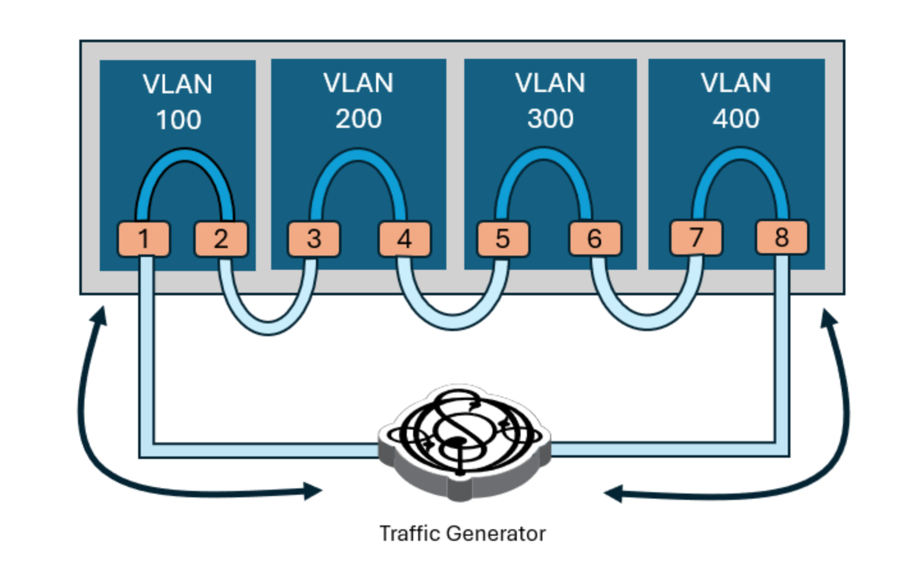

# Devices

For each device tested there should be a directory with the device identifier as name. That directory should contain the file `config.yml` and the config file with the port config information, usually called `ports.yml`. Provided are templates for these files as well as an example directory and directories of devices we worked with. In there will also be the output of the model derivation.

Note that the files in `example/` are only there to give an impression of how those files might look like and are not consistent with each other. Also note that the files for the devices we worked with might be outdated and not work with the current format that is expected by the code. It is safe to follow the format used in the templates and `example/`.

## Subdirectory structure

```
.
├── config_template.yml
├── example
│   ├── config.yml
│   ├── ports.yml
│   ├── power_data.yml
│   └── power_model_<port_type>_<port_speed>_<transceiver_type>_<traffic_generator>.yml
├── ports_template.yml
└── README.md
```

## config.yml

This file should contain the device specific information, parameters for the measurements and external dependencies. It is necessary that it is called `config.yml` and in the subdirectory with the device identifier as name. 

The detailed explanation about the parameters is in the template.

## port.yml

This file should contain the information necessary in order to configure the ports for the experiments. 

For each port type available there should be a respective section as shown in the template. This section contains the following information:

- `ids`: This should be a list of all port numbers of this type. Note that for some test types the order of the numbers matters (details below). 
- `speeds`: This should be a list of all speeds this port type supports. For each speed available for this port type there should be a section for the speed. It should contain a speed label and a interface label. The speed label and interface label should be listed with `PORT` as placeholder for the port number. Furthermore, one speed type needs to be listed as default. This is especially relevant for machines with multiple port types as all port types that are not tested will be disables using the default speed and interface labels.
- `commands`: The four types of commands needed are described below. 

Note that for all commands exept `system`, interface labels and speed labels should use the placeholders `INTERFACE_LABEL` and `SPEED_LABEL`. When generating the command to configure the ports, the placeholders `INTERFACE_LABEL`, `SPEED_LABEL` and `PORT` will be replaced with the speed and interface label from the speed listed in `exp.yml`, `PORT` will be replaced with the number of the port. 

From our experience, finding the right commands is one of the most challenging parts or using the code. The script `test_config.py` in `test_config/` is intended to help with this process(further details [here](../test_config/README.md)). 

### system

If reconfiguration is not disabled, this command will be run once before running any experiment. It is intended for configuring the device's system, if necessary, and is assumed inependent from speed labels, interface labels or port numbers. It can be left empty. 

One example for a use of this is setting the system MTU to 6000 instead of the default 1500. 

### enable

This command should enable a port. When generating the configuration command, this command will be used for each port that should be enabled.  

Note that if a port needs manual speed configuration, this should be included in this command. 

### disable

This command should disable an interface. 

### snake-test

This command shoud:

- Enable the interface
- Set it to layer 2 (switchport) mode
- Set it to access mode
- Assign it to the `VLAN` with number `VLAN_NUMBER` (will be replaced with actual number by the code)
- Set it to speed `SPEED_LABEL`

Note that in order to correctly configure some devices correctly for snake-test, we had to add the following instructions to the command:
- Set the mtu to 6000 to support jumbo frames (for tests with big packets)
- Disable the spanning tree protocol for a VLAN as packets would not get forwarded otherwise

For further information, please refer to [[3]](../README.md#references). 

### ID order for port and trx

In order to run a port or trx test, each port will be connected to another port (compare setup for these test types). The assumed pairing of the ports is implied by the order the port numbers are listed. Namely, if port `i` and `j` are connected, then their numbers need to be next to each other in the listing. 

As an example, consider the following port listing:
```
ids:
    - 1
    - 2
    - 3
    - 4
    - 5
    - 6
```
The code will assume that port 1 will be connected with port 2, 3 with 4 and 5 with 6. 

### ID order for snake-test

When running a snake-test, two consecetively listd ports will be assigned to the same VLAN. It is assumed that the first and the last port listed are source and sink of the traffic and that the remaining ports are each physically connected with a port that is **not** in the same VLAN. For better understanding, please refer to the image below and the source mentioned. The corresponding listing would be 
```
ids:
    - 1
    - 2
    - 3
    - 4
    - 5
    - 6
    - 7
    - 8
```



Source: [[3]](../README.md#references)

## power_data.yml

This file is the output of the preprocessing of the model derivation. The keys of the nested dictionaries correspond to the respective test parameters the timestamps and power values  belong to. The structure can be read like this:

```
<port_type>:
  <transceivers>:
    idle:
      <port_number>:
        power: # Median of the power values sampled in that test
        - 328.38
        - 327.74
        - 
        ts: # Timestamp of the test
        - 2025-05-20_11:09:56
        - 2025-05-20_11:48:30
        -
    port:
      <port_speed>:
        <port_number>:
          power:
          - 
          ts:
          - 
        
    snake-test:
      <port_speed>:
        <port_number>:
          <packet_size>:
            <bandwidth_reached>:
              power:
              - 
              ts:
              - 
    trx:
      <port_speed>:
        <port_number>:
          power:
          - 
          ts:
          - 
base:
  power:
  - 
  ts:
  - 
device: <device_id>

```

## power_model_\<params>.yml

This file is the output of the model derivation and contains the parameters of the experiment together with the values of the parameters of the power model generated. 