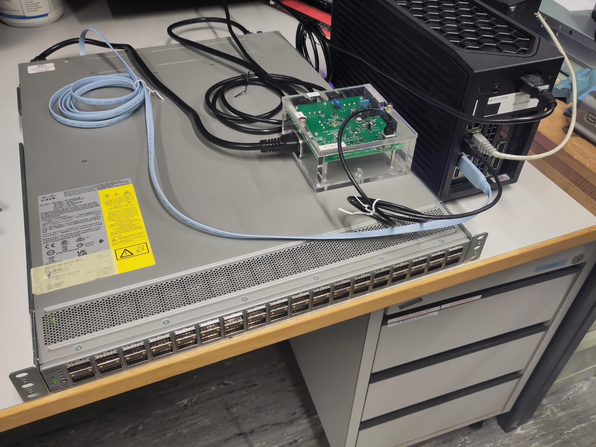
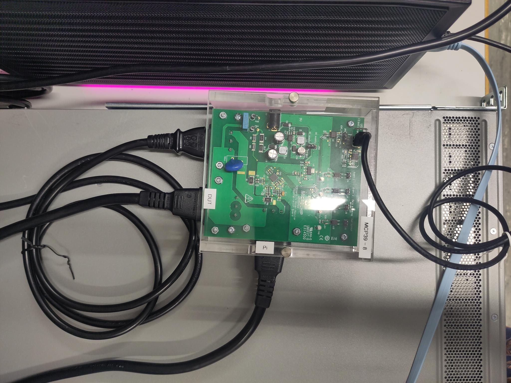
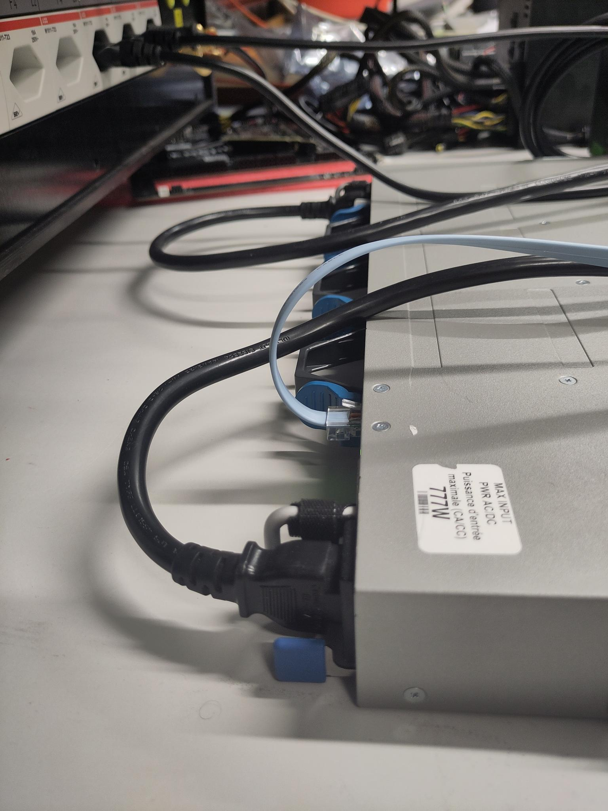
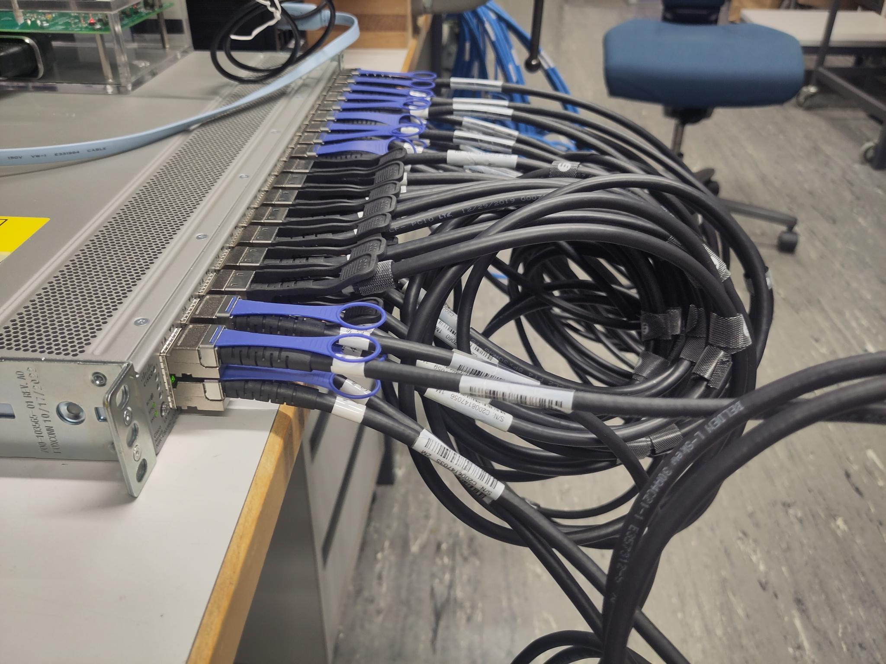
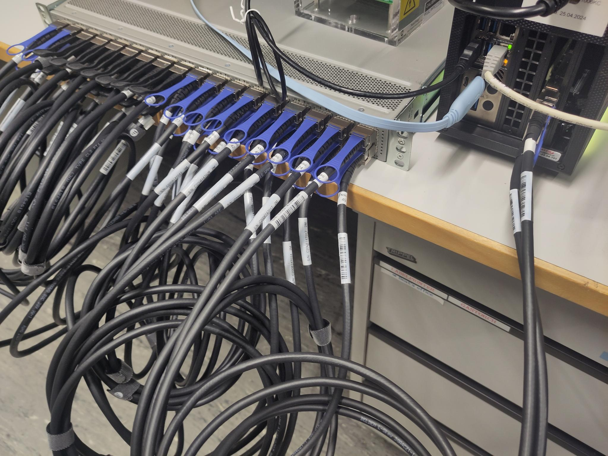
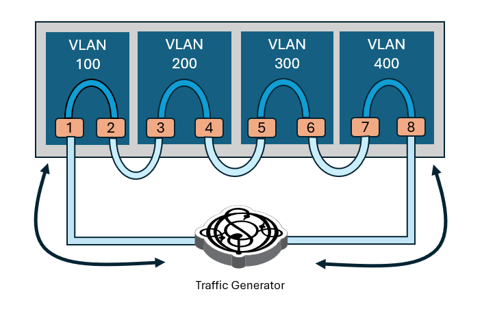

# Power measure

This directory contains the code that configures the device and runs the actual measurements. There are five different types of experiments needed in order to have the data necessary to derive the power model and it is recommended to have multiple runs of an experient to improve the quality of the model.

## Subdirectory structure

```
.
├── exp_example.yml
├── exp_template.yml
├── exp.yml
├── figures
│   └── ...
├── helper_functions.py
├── main.py
└── README.md

```

## Code description

Tests are run for a specific port type, port speed and transceiver type. It is assumed that all transceivers used are of the same type. If a device has multiple port types available, the setup described below only correspond to the type to be tested. All other ports will be disabled and should not have anything plugged in. 

There are five different types of experiments. They are characterized by the state the device is in and whether there is traffic.  
| **Test Type**   | **Transceivers**                                  | **Port State**                                        | **Traffic**     | **Description**                                                                 |
|------------------|---------------------------------------------------|--------------------------------------------------------|------------------|----------------------------------------------------------------------------------|
| `base`           | None plugged in                                   | All ports disabled                                     | No traffic       | Minimal setup for baseline power measurement.                                   |
| `idle`           | All plugged in                                    | All ports disabled                                     | No traffic       | Measures idle power with all transceivers present.                              |
| `port`           | All plugged in, each port connected to another    | One port in each pair enabled, the other disabled      | No traffic       | Measures power with partially active connections.                               |
| `trx`            | Same as `port`                                    | All ports enabled                                      | No traffic       | Measures power with all ports fully active.                                     |
| `snake-test`     | See [[3]](../README.md#references)                | Based on snake-test config                             | Based on config  | Full traffic test, described in more detail in the referenced documentation.    |


In order to get a better understanding of how the experiment types work and how they are used to infere the power model, please refer to [[1]](../README.md#references). 

The code has the following workflow:
1. Load the parameters needed from the different config file
2. If not disabled: Configure system and reset entire device
3. Take the cross product of the different speeds and experiment types, repeat them as specified and then randomize the order. Each of them specify one test.
4. For each test: 
    1. Configure the device as needed 
    2. tart traffic (if needed)
    3. Run the measurements using the pinpoint software
    4. Save the measurements in `data/`

Note that for port and trx instead of measuring the power of all ports at once, there are multiple runs with a randomized selection of ports. The effective value will be determined by a regression over those measurements during the model derivation. 

For snake-test, there will be a run for each combination of packet sizes and bandwidth specified in `traffic_gen/traffic.yml` (details [here](../traffic_gen/README.md)).

## Physical Setup

### General setup

The experiment setup has the following components:
- A device under testing (DUT)
- A powermeter
- A workstation that runs this code and is able to generate the traffic.

The workstation needs a serial connection to the DUT that is ready to send commands over. Note that this might require some prior login into the system of the DUT. 
This can mean for example that every time after the start up of the DUT there is a prompt in minicom to log in as admin with password in order to be able to send configuration commands. 
It is recommended to test this connection and verify that configurations can be applied successfully using the code in `test_config/`. 

The DUT needs to be plugged into the powermeter so that the powermeter can measure its energy draw. Furthermore, the powermeter needs to be connected to the workstation. 


*Figure 1: This is how the general setup could look like. The router is connected to the workstation via the light blue cable, the serial connection. The powermeter is connected to the workstation.*


*Figure 2: The powermeter has two channels, labelled with DUT and Pi. They are connected to the DUT.*


*Figure 3: Back of the DUT*


### Base test

For a base test, no transceivers should be plugged in (like in Figure 1).

### Idle, port and trx test

All ports should have transceivers plugged into them. 

For port and trx it is important that ports are connected to each other and that the listing in `ports.yml` alilgns with the order (for details, refer to `devices/`).


*Figure 4: The ports are always connected with the adjacent one.*

### Snake test

Two ports need to be connected to the workstation. The rest of the ports need to be connected to another port each. Note that here as well the listing in `ports.yml` needs to align with the way the ports are connected to each other. 


*Figure 5: The two rightmost ports are connected to the workstation.*


## Port configuration

The port configuration will be handled by the code if not disabled.

Before each test, the code will send the commands listed in `ports.yml` under `system` to the DUT.  

### Base and idle

All ports will be disabled using the command listed in `ports.yml` under `disable`. 

### Port

As mentioned above, to conduct a port test, there are multiple iterations with each having a different number of ports active. The port pairs are selected randomly. Out of each port pair that was selected, one of the ports will be enabled using the command listed in `ports.yml` under `enable`. 

As the selection is randomized, this can't be disabled.

### Trx

Trx works the same as port with the only difference that out of a selected port pair, both ports are enabled. 

### Snake-test

All ports will be configured with the commands listed in `ports.yml` under `snake-test`. Note that this need to involve enabling the port and assigning it to a VLAN. A more detailed descriprion is found [here](../devices/README.md#portyml) 


*Figure 6: Illustration of the VLAN setup. Source[[3]](../README.md#references)*


## Usage specification

In order to run one or multiple experiments, these are the recommended steps:
1. Ensure that the following files are present and contain the necessary information:
    - `devices/<device_id>/config.yml`
    - `devices/<device_id>/ports.yml`
    - `traffic_gen/traffic.yml` (for snake-test)

    Note that in order to fill out `ports.yml` one needs to know the commands to configure the device. The different command types needed are described in detail in [here](../devices/README.md#portyml). `test_config.py` intended to help with this. 

2. Arrange the physical setup of the experiment as described above. 
3. Double check the port order in `port.yml` and whether it is consistant with the physical setup. Remember that this means:
   - Port, trx and snake-test: Connected ports have to be listed right after each other
   - Snake-test: The ports connected to the workstation have to be listed first and last 
4. Set the experiment parameters. These can be either set in `exp.yml` or given to the program via the CLI. For further details, please refer to [`exp_template.yml`](exp_template.yml) or use `python main.py --help`.
5. Optionally: Preconfigure the device using `test_config.yml` and disable reconfiguration. This can save time for e.g. snake-test (details [here](../test_config/README.md#usage-specification)).
6. Run the `main.py` with 
   -  ```python main.py``` (if `exp.yml` is available)
   -  ```python test_main.py -d <device_id> -e <exp_type_list> -s <speed_list> -p <port_type> -t <transceivers> -r <repeats> [-u] [--disable_reset] [--not_reconfigure]```

Note that with `user_confirm = True`, the code will pause and ask for a confirmation of the setup and configuration. This will allow you to change the setup if multiple different experiment types are run in one execution, but will also make it necessary for you to monitor the execution more carefully. For tests that take a longer amount of time, it might be more convenient to only mix experiment types that use the same physical setup to avoid stalling. 

## Output explanantion

For each concrete measurement the code will save two files in `data/ <log_path> /<timestamp>`:
- `power.log`: This files contains the power values sampled by the powermeter during the measurement time
- `metadata.yml`: This file contians the metadata of the experiment, which includes the information about the device from `config.yml` as well as information specific to the run like `timestamp`, `bandwidth_reached` (for snake-test), `port_list` etc. 

Note that the log path encodes the relevant parameters of the experment. A more detailed description is found [here](../README.md#data). 