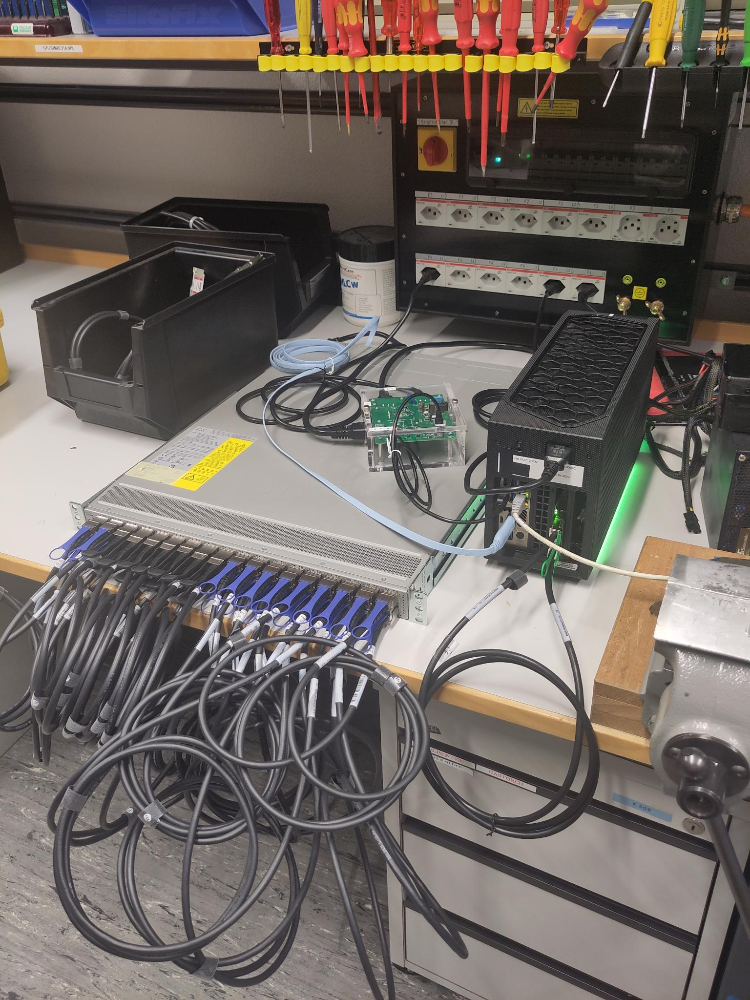

# Power measure

This directory contains the code that configures the device and runs the actual measurements. There are five different types of experiments needed in order to have the data necessary to derive the power model and it is recommended to have multiple runs of an experient to improve the quality of the model.

## Submodule structure

```
.
├── exp_template.yml
├── exp.yml
├── helper_functions.py
├── main.py
└── README.md
```

## Code description

Tests are run for a specific port type, port speed and transceiver type. It is assumed that all transceivers used are of the same type. If a device has multiple port types available, the setup described below only correspond to the type to be tested. All other ports will be disabled and should not have anything plugged in. 

There are five different types of experiments. They are characterized by the state the device is in and whether there is traffic.  
- **base**: No transceivers are plugged in, all ports are disabled, no traffic. 
- **idle**: All transsceivers are plugged in, all ports are disabled, no traffic. 
- **port**: All transceivers are plugged in such that each port is connected to another port. Out of each port pair, one port is enabled and one is disabled. No traffic. 
- **trx**: Same setup as for port, but this time, all ports will be enabled. 
- **snake-test**: A detailed description of snake-test is provided in [[3]](../README.md#references). 

In order to get a better understanding of how the experiment types work and how they are used to infere the power model, please refer to [[1]](../README.md#references). 

The code has the following workflow:
1. Loads the parameters needed from the different config file
2. If not disabled: Configures system and resets entire device
3. Takes the cross product of the different speeds and experiment types, repeat them as specified and then randomize the order. Each of them specify one test.
4. For each test: 
    1. Configure the device as needed and start traffic if needed
    2. Run the measurements using the pinpoint software
    3. Save the measurements in `data/`

Note that for port and trx instead of measuring the power of all ports at once, there are multiple runs with a randomized selection of ports. The effective value will be determined by a regression over those measurements. 

For snake-test, there will be a run for each combination of packet sizes and bandwidth specified in `traffic_gen/traffic.yml` (details [here](../traffic_gen/README.md)).

## Physical Setup

### General setup

The experiment setup has the following components:
- A device under testing (DUT)
- A powermeter
- A workstation that runs this code and is able to generate the traffic.

The workstation needs a serial connection to the DUT that is ready to send commands over. Note that this might require some prior login into the system of the DUT. It is recommended to test this connection and verify that configurations can be applied successfully using the code in `test_config/`. 

The DUT needs to be plugged into the powermeter so that the powermeter can measure its energy draw. Furthermore, the powermeter needs to be connected to the workstation. 

This image should give an impression of how a setup could look like.




### Base test

For a base test, no transceivers should be plugged in. 

### Idle, port and trx test

All ports should have transceivers plugged into them. 

For port and trx it is important that ports are connected to each other and that the listing in `ports.yml` alilgns with the order (for details, refer to `devices/`).

### Snake test

Two ports need to be connected to the workstation. The rest of the ports need to be connected to another port each. Note that here as well the listing in `ports.yml` needs to align with the way the ports are connected to each other. 

## Usage specification

In order to run one or multiple experiments, these are the recommended steps:
1. Ensure that the following files are present and contain the necessary information:
    - `devices/<device_id>/config.yml`
    - `devices/<device_id>/ports.yml`
    - `traffic_gen/traffic.yml` (for snake-test)
2. Set the experiment parameters. These define what kind of experimet will be run and can be either set in `exp.yml` or given to the program via the CLI. For further details, please refer to the template provided or use `--help`.
3. Arrange the physical setup according to the experiment parameters as described above. 
4. Optionally: Preconfigure the device using `test_config.yml` and disable reconfiguration. This can save time for e.g. snake-test (details [here](../test_config/README.md#usage-specification)).
5. Run the code

Note that with `user_confirm = True`, the code will pause and ask for a confirmation of the setup and configuration. This will allow you to change the setup if multiple different experiment types are run in one execution, but will also make it necessary for you to monitor the execution more carefully. For tests that take a longer amount of time, it might be more convenient to only mix experiment types that use the same physical setup to avoid stalling. 

## Output explanantion

For each concrete measurement the code will save two files in `data/ <log_path> /<timestamp>`:
- `power.log`: This files contains the power values sampled by the powermeter during the measurement time
- `metadata.yml`: This file contians the metadata of the experiment, which includes the information about the device from `config.yml` as well as information specific to the run like `timestamp`, `bandwidth_reached` (for snake-test), `port_list` etc. 

Note that the logpath encodes the relevant parameters of the experment. A more detailed description is found [here](../README.md#data). 